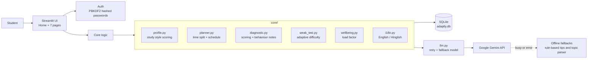

# 🎯 Adaptly

**Study at your pace, with a plan that adapts to you.**

> ForgeHacks submission · Track: **AI + Education**
> Demo video: `<paste YouTube link>` 

Adaptly is a personalised exam-preparation companion for students who get little one-to-one guidance. It learns *how* a student studies, finds *what* they are weak at, and builds a daily plan that rebuilds itself when life, tests, or tiredness change things. It works in **English** and **Hinglish** (Hindi written in Roman letters), with Punjabi answers from the AI.

---

## 1. The problem

Students preparing for board exams or semester exams usually get one generic timetable and one generic set of notes. Many, especially in government schools and smaller towns:

- have no mentor to tell them which topics to spend time on,
- study in a language that most AI tools support poorly,
- have several exams at once and no principled way to split their time,
- have no signal that they are tired or overloaded until results suffer.

## 2. Target users

A school or college student with a heavy syllabus and several exams (for example a Class 12 board student, or a first-year engineering student) who prefers to study in English or Hindi/Hinglish.

## 3. What Adaptly does

The core loop:

```
Study Style Check → Knowledge Diagnostic → Weak Topics found → Personal Plan
        ↑                                                           ↓
   Plan rebuilds ← Weak-Topic Test ← Study with AI Helper ← Daily check-in
```

| Feature | What it does |
|---|---|
| **Login / sign-up** | Username + password. Passwords are salted and hashed (PBKDF2-SHA256), never stored in plain text. |
| **Syllabus upload** | Upload a PDF or paste text. The AI extracts topics with difficulty and estimated hours. If the AI is busy, a rule-based parser takes over. |
| **Study Style Check** | 10 everyday-life questions measuring planning style, focus span, pressure comfort, self-drive and group learning. Results set session length, break length and buffer time. |
| **Mock tests and diagnostic** | Multiple-choice questions generated from the student's own syllabus, in their language. Scores per topic are saved. |
| **Weak-Topic Test** | Tests only weak topics, with difficulty chosen from the current score. Shows before/after improvement and can write revision notes. |
| **Smart Study Plan** | Splits daily hours across all exams and self-study goals, then builds a day-by-day schedule with Learn and Revision phases. |
| **Adaptive re-planning** | Weak topics get extra slots. Missed sessions move to the front of the queue. Lower progress or poor test scores change the next plan automatically. |
| **Exam-week mode** | In the last 7 days the plan becomes revision-focused, lighter, and reminds the student to sleep. |
| **AI Helper** | A chat tutor that knows the student's goals, weak topics and today's plan. Replies stream in word by word. |
| **Teach-back mode** | The student explains a topic and the AI acts like a curious beginner, asking questions and pointing out gaps, then gives feedback out of 10. |
| **Wellbeing check-in** | A 30-second mood and energy check. If the last three check-ins are low, the plan becomes 20% lighter and the app suggests talking to a trusted person. |
| **Dashboard** | Streak, total study time, plan follow-through, test score trend, topic strength, mood trend. |

## 4. How the time split works

Time is split with plain, explainable code (no black box):

```
weight = marks × (1 − syllabus covered) × difficulty ÷ √(days left)
share  = weight ÷ sum of all weights
hours for a goal today = share × daily study hours
```

Higher weightage, harder subjects, more syllabus left and closer deadlines all get more time. The study style result then adjusts session length (25 / 40 / 55 minutes), break length and buffer percentage.

## 5. Architecture



**Design choice:** the AI writes content (questions, explanations, tips, chat). Everything that decides the student's plan (scoring, weak-topic detection, time split, scheduling) is ordinary, testable code. This keeps the plan predictable and means most of the app still works if the AI service is busy.

## 6. Tech stack

- **Python 3.13**, **Streamlit** (UI)
- **Google Gemini API** via `google-genai` (question generation, tutor, summaries), with a main model, a fallback model, retries and JSON repair
- **SQLite** (local storage)
- **pypdf** (syllabus PDFs), **pandas** (tables and charts), **python-dotenv**
- No model training is required: the project uses pre-trained models through an API.

## 7. Project structure

```
adaptly/
├── Home.py                 # landing page, login, sign-up
├── pages/
│   ├── 1_Diagnostic.py     # study style check
│   ├── 2_Study_Plan.py     # goals, schedule, time split
│   ├── 3_AI_Helper.py      # tutor + teach-back
│   ├── 4_Mock_Test.py      # knowledge diagnostic and mocks
│   ├── 5_Check_in.py       # wellbeing check-in
│   ├── 6_Dashboard.py      # progress
│   └── 7_Weak_Topic_Test.py
├── core/                   # llm, planner, profile, diagnostic, weak_test,
│                           # wellbeing, tutor, syllabus, auth, i18n, style
├── db/database.py          # SQLite access
├── check.py                # health check for the whole project
├── .streamlit/config.toml  # theme
└── requirements.txt
```

## 8. Setup

```bash
# 1. clone and enter the folder
git clone <your-repo-url>
cd adaptly

# 2. create a virtual environment
python -m venv venv
venv\Scripts\activate          # Windows
# source venv/bin/activate     # macOS / Linux

# 3. install
pip install -r requirements.txt
```

Create a file named `.env` in the project folder:

```
GEMINI_API_KEY=your_key_here
MODEL_NAME=gemini-3.5-flash-lite
FALLBACK_MODEL=gemini-3.8-flash
```

Get a free key at [aistudio.google.com/apikey](https://aistudio.google.com/apikey). Model names change over time, so update `MODEL_NAME` if you see a "model not found" error.

Run:

```bash
python check.py ai        # optional health check (also tests the AI)
streamlit run Home.py
```

`requirements.txt`:

```
streamlit
google-genai
python-dotenv
pypdf
pandas
```

## 9. Responsible AI

- **No diagnosis.** The Study Style Check describes study habits only. It does not measure personality, intelligence, anxiety or any medical or psychological condition, and every screen says so.
- **Gentle wellbeing support.** Low check-ins make the plan lighter and suggest talking to a teacher, parent, friend or counsellor. The app shows the Tele-MANAS helpline (14416) and states that it cannot replace a doctor or counsellor. It never labels the student.
- **AI can be wrong.** The tutor and notes carry a reminder to verify with a textbook or teacher, and the tutor is instructed to say when it is unsure.
- **Decisions are explainable.** Weak topics, the time split and the schedule come from visible rules, not from the AI.
- **Privacy.** Student data is stored locally in SQLite. Passwords are hashed with a per-user salt. No data is sold or shared. The only data sent out is the prompt text (syllabus topics, questions, chat) that goes to the Gemini API.
- **Reliability.** If the AI is busy, Adaptly retries, switches to a fallback model, and uses rule-based fallbacks for topic extraction and study tips.

## 10. Limitations (honest list)

- Login is for demonstration. A production version needs persistent sessions, password reset and email verification.
- Browser refresh logs the user out (Streamlit session state).
- AI-generated questions can contain errors and are not checked against a syllabus answer key.
- Hinglish and Punjabi quality depends on the model and has had only limited testing. Page labels are English or Hinglish; Punjabi pages show English labels with Punjabi AI replies.
- The free Gemini tier has rate limits and can return "high demand" errors at busy times.
- The style check is a short self-report questionnaire. It adjusts study settings, but it is not a validated psychological test.
- SQLite is single-machine storage and is not meant for many simultaneous users.

## 11. Real-world impact and feedback

> Fill this in after 3–5 students try the app.

| Tester | What they used | What they said |
|---|---|---|
| Student 1 | | |
| Student 2 | | |
| Student 3 | | |

## 12. Future work

- React front end with a FastAPI backend and proper authentication
- Teacher view to see class-wide weak topics
- Voice input and read-aloud for low-literacy and visually impaired students
- Punjabi and other regional-language page labels reviewed by native speakers
- Answer-key checking for generated questions
- Spaced-repetition scheduling for revision

## 13. Team

`<names, roles>`

## 14. Screenshots

`<add images: home, study style result, mock test result, study plan, AI helper, dashboard>`

---

*Adaptly is a study aid. It does not replace teachers, counsellors, or medical professionals.*
